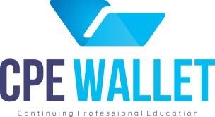

# CPE Wallet 🎓

A credential management platform designed for professionals to track their Continuing Professional Education (CPE) credits and certifications.



## 📋 Table of Contents

- [About](#about)
- [Features](#features)
- [Tech Stack](#tech-stack)
- [Getting Started](#getting-started)
- [Project Structure](#project-structure)
- [Documentation](#documentation)
- [Contributing](#contributing)

## 🎯 About

CPE Wallet helps licensed professionals—including CPAs, attorneys, doctors, and other professionals—manage their continuing education requirements in one centralized platform. No more scattered certificates or manual tracking!

### Problem Statement

Professionals are required by their respective state boards to maintain CPE credits to keep their licenses active. Currently, managing these certifications is tedious:

- Manual certificate uploads one at a time
- Difficult progress tracking toward required credits
- No centralized view of all certifications
- Varying state requirements

### Our Solution

CPE Wallet provides an intuitive interface for:

1. **📤 Uploading Certificates** - Easy drag-and-drop file upload
2. **📊 Tracking Progress** - Visual dashboard showing required vs. completed credits
3. **🗂️ Managing Certifications** - Centralized table view of all certificates
4. **👤 Profile Management** - Personal information and settings

## ✨ Features

### Dashboard
- Progress overview with required, completed, and remaining credits
- Certifications table with all uploaded certificates
- Quick-add certificate functionality

### Certificate Management
- Add new certificates with title, credits, organization, and date
- Upload certificate files (PDF, images)
- View and manage existing certificates

### Profile Management
- Update personal information
- Change profile picture
- Manage contact details

## 🛠️ Tech Stack

- **Frontend Framework:** React 18 + TypeScript
- **Build Tool:** Vite
- **Routing:** TanStack Router (file-based routing)
- **Styling:** TailwindCSS
- **Icons:** Lucide React
- **Design Pattern:** Atomic Design

## 🚀 Getting Started

### Prerequisites

- Node.js (v18 or higher)
- npm or yarn

### Installation

1. Clone the repository:
```bash
git clone https://github.com/GeneralJerel/CPE-Wallet.git
cd CPE-Wallet
```

2. Install dependencies:
```bash
npm install
```

3. Start the development server:
```bash
npm run dev
```

4. Open your browser and navigate to `http://localhost:5173`

### Available Scripts

| Command | Description |
|---------|-------------|
| `npm run dev` | Start development server |
| `npm run build` | Build for production |
| `npm run preview` | Preview production build |
| `npm run lint` | Run ESLint |

## 📁 Project Structure

```
src/
├── assets/              # Logo and static assets
├── components/          # Atomic design component structure
│   ├── atoms/          # Basic building blocks (Button, Input, Avatar)
│   ├── molecules/      # Combinations of atoms (InputField, StatCard)
│   ├── organisms/      # Complex components (Header, CertificationsTable)
│   └── templates/      # Page layouts
├── mock-data/          # Mock API data (until backend integration)
│   ├── certifications.ts
│   └── user.ts
├── routes/             # TanStack Router file-based routes
│   ├── __root.tsx     # Root layout
│   ├── index.tsx      # Dashboard page
│   ├── login.tsx      # Login page
│   ├── profile.tsx    # Profile management page
│   ├── success.tsx    # Success page
│   └── verify.tsx     # Verification page
├── index.css          # Global styles and Tailwind imports
└── main.tsx           # Application entry point
```

## 📚 Documentation

Comprehensive documentation is available in the `/docs` directory:

- **[Product Overview](docs/product/overview.md)** - Product vision, features, and user roles
- **[Technical Architecture](docs/technical/architecture.md)** - System architecture and design decisions
- **[Component Documentation](docs/technical/components.md)** - Detailed component specifications

## 🎨 Design System

### Color Palette

| Color | Hex | Usage |
|-------|-----|-------|
| Valhalla | `#242343` | Primary brand color, buttons, headings |
| Azure | `#F9FFFF` | Light text on dark backgrounds |
| Cornflower | `#414277` | Links and interactive text |
| Sky Accent | `#00B8F1` | Accent color, icons |

### Typography

- **Montserrat** - Headings, labels, buttons
- **Quicksand** - Subtitles, descriptions
- **Inter** - Body text, form inputs

## 🗺️ Roadmap

### Current Phase: Frontend Development
- ✅ Component library with atomic design
- ✅ Dashboard with progress tracking
- ✅ Certificate management
- ✅ Profile management
- ✅ Mock data integration

### Next Phase: Backend Integration
- [ ] API development
- [ ] Authentication system
- [ ] Database integration
- [ ] File storage for certificates
- [ ] Certificate validation

### Future Features
- [ ] Multi-state requirement tracking
- [ ] Export functionality (PDF reports)
- [ ] Certificate deletion/editing
- [ ] CPE provider portal
- [ ] State board integration
- [ ] Mobile app

## 🤝 Contributing

Contributions are welcome! Please feel free to submit a Pull Request.

1. Fork the project
2. Create your feature branch (`git checkout -b feature/AmazingFeature`)
3. Commit your changes (`git commit -m 'Add some AmazingFeature'`)
4. Push to the branch (`git push origin feature/AmazingFeature`)
5. Open a Pull Request

## 📄 License

This project is private and proprietary.

## 👥 Team

- **Jerel** - Initial work - [GeneralJerel](https://github.com/GeneralJerel)

## 🙏 Acknowledgments

- Built with modern React best practices
- Follows atomic design principles
- Implements accessible UI patterns

---

Made with ❤️ for professionals who value their continuing education

